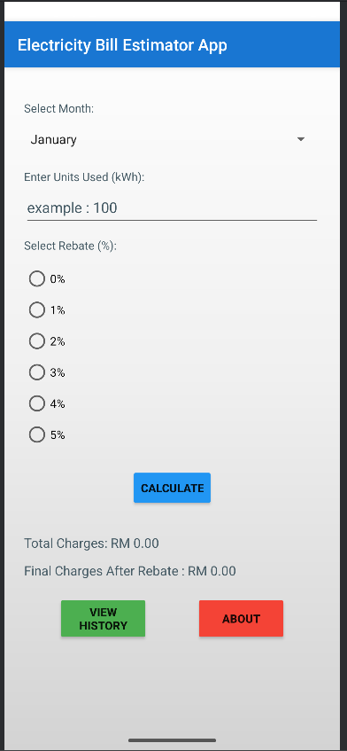
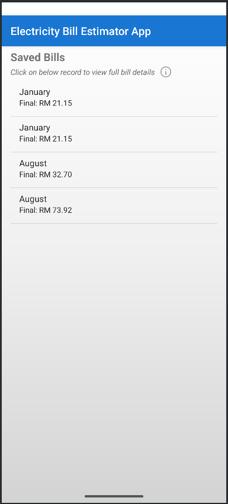
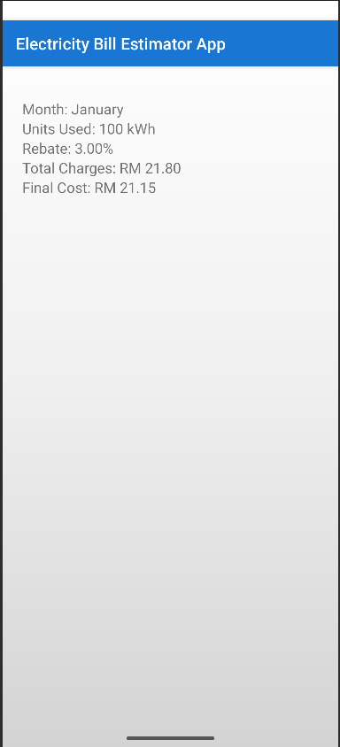
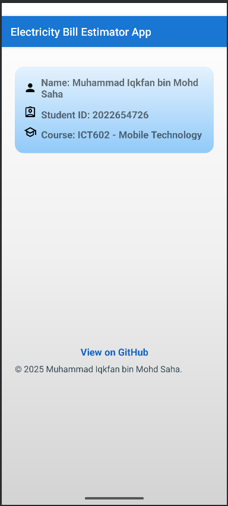

# ⚡ Electricity Bill Estimator

An Android mobile application to estimate monthly electricity bills based on usage and rebate. Built using Kotlin in Android Studio.

---

## 📱 Features

- Select month of usage
- Enter electricity units used (kWh)
- Choose rebate percentage (0–5%)
- Block-based tariff calculation
- Final cost displayed after rebate
- Save and view billing history (SQLite)
- Detail view for each record
- About page with author info and GitHub link

---

## 📷 Screenshots

# Main

# History

# Details

# About

---

## 🧮 Tariff Block Charges

| Usage Range (kWh) | Rate (sen/kWh) |
|-------------------|----------------|
| 1 - 200           | 21.8 sen       |
| 201 - 300         | 33.4 sen       |
| 301 - 600         | 51.6 sen       |
| 601 and above     | 54.6 sen       |

**Final cost formula:**

Final Cost = Total Charges - (Total Charges × Rebate%)

---

## 💻 Tech Stack

- Android Studio + Kotlin
- ConstraintLayout
- SQLite (Local DB)
- Material Design Components

---

## 👤 About
- Name: Muhammad Iqkfan bin Mohd Saha
- Student ID: 2022654726
- Course: ICT602 – Mobile Technology

---

## 📜 License
This project is for educational use only.
© 2025 Muhammad Iqkfan bin Mohd Saha.
